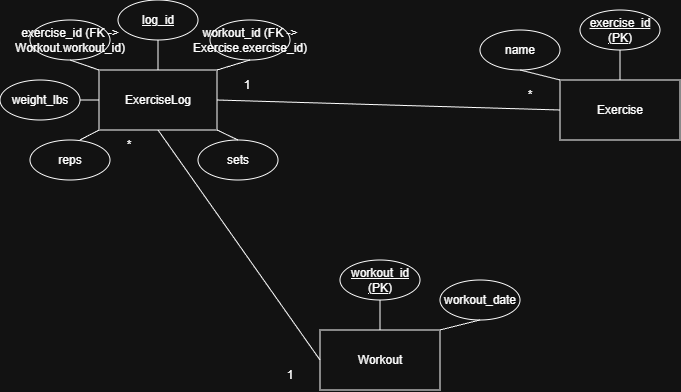

## Entities

### Workout
- workout_id (PK)
- workout_date (DATE, UNIQUE, NOT NULL)

### Exercise
- exercise_id (PK)
- name (TEXT, UNIQUE, NOT NULL)

### ExerciseLog
- log_id (PK)
- workout_id (FK -> Workout.workout_id)
- exercise_id (FK -> Exercise.exercise_id)
- weight_lbs (REAL, NOT NULL)
- reps (INTEGER, NOT NULL)
- sets (INTEGER, NOT NULL)

## Relationships
- Workout 1 - * Exerciselog
- Exercise 1 - * Exerciselog

## Design Decisions
- Workouts are implicitly created based on date.
- Sets are stored as a homogeneous group.
- Exercises are normalized to avoid duplication.
- Weight is stored in pounds as canoical unit.

## Entity–Relationship Diagram
